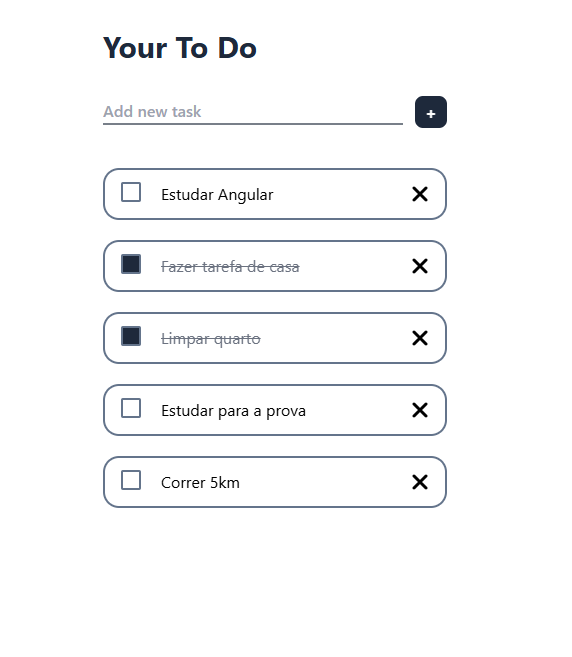

# 📋 Todo-List

✨ Lista funcional desenvolvida com <a alt="Nx logo" href="https://nx.dev" target="_blank" rel="noreferrer"></a>

## ⚙️ Funcionalidade

- Listagem simples
- Mudança de status
- Testes unitários cobrindo as funcionalidades principais

## 🚀 Tecnologias utilizadas

- Nx – Monorepo inteligente com gerenciamento eficiente
- TypeScript – Tipagem para maior consistência
- TailwindCSS – Estilização elegante com utilitários
- Jest – Testes automatizados com cobertura confiável

## 📸 Visualizar



## 📦 Instalação e uso

### Instalar dependências

```
npm install
```

### Rodar aplicação em modo dev

Execute `npx nx serve todo` para iniciar o servidor de desenvolvimento. Boa programação!

## 🧪 Testes

Rodar testes com Jest

```
npx nx test todo
```

## 📄 Licença

Este projeto está sob a licença MIT. Veja o arquivo LICENSE para mais detalhes.
